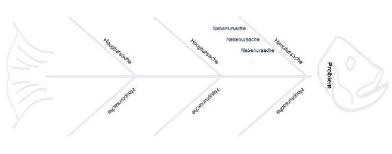

# Methoden
<link rel="stylesheet" href="https://cdnjs.cloudflare.com/ajax/libs/font-awesome/4.7.0/css/font-awesome.min.css">

In diesem Abschnitt erhalten Sie einen Überblick über Lehr- und Lernmethoden, die in der Lehre zum Einsatz kommen können. Das Methodenglossar ist alphabetisch geordnet und berücksichtigt verschiedene Einsatzszenarien (Einstieg, Erarbeitung, Sicherung, Feedback).

  <button class="accordion">Ampelfeedback</button>
  

    

      Bei dem Ampelfeedback handelt es sich um eine Methode, die darauf zielt, Meinungen, Sichtpunkte oder Bewertungen einer Gruppe zu einer bestimmten Fragestellung einzuholen. Sie  eignet sich zudem zur Entscheidungsfindung.  Die Teilnehmenden erhalten jeweils eine rote, gelbe und grüne Karte und sollen sich mit dieser zu einer Frage, These oder Annahme positionieren.  Die Wahl der grünen Karte, bedeutet Zustimmung oder positive Bewertung, die Wahl der roten Karte drückt Ablehnung oder negative Bewertung aus und die gelbe Karte zeigt Unentschlossenheit oder Verbesserungsvorschläge an (vgl. Szepansky 2010, wb-web o. J.).
    

  <button class="accordion">Auswertungszielscheibe</button>
  

    

      Die Auswertungszielscheibe kann für Zwischenfeedback oder für die abschließende Reflexion einer Gruppenarbeit eingesetzt werden, um den gesamten gemeinsamen Arbeitsprozess zu reflektieren. Hierfür wird auf einer Pinnwand o.Ä. eine Zielscheibe bereitgestellt, auf der von 1 (Volltreffer = Mitte) bis 5 (kaum = Rand) verschiedene Aspekte der Gruppenarbeit bewertet werden können. Im ersten Schritt erstellen die Gruppenmitglieder die Bewertungen für sich selbst. Anschließend kann die Möglichkeit gegeben werden, sich über die vorgenommenen Bewertungen in Tandems oder Kleingruppen auszutauschen. Zuletzt werden die Bewertungen auf die gemeinsame Zielscheibe übertragen und gemeinsam ausgewertet (vgl. Frank/ Reinmuth o.J.).
    

  <button class="accordion">Cluster</button>
  

    

      Bei der Clustering-Methode wird ein Oberbegriff bestimmt und mittels Brainstorming zunächst alle Begriffe gesammelt, die die Gruppe (oder die Einzelperson) mit dem Begriff assoziiert. Anschließend werden die Begriffe zum Oberbegriff und auch zueinander in Verbindung gesetzt und kategorisiert. Während bei der verwandten Mindmapping-Methode die Hierarchisierung der Begriffe wesentlich ist, zielt Clustering auf die Ideenfindung und die Verknüpfung von Ideen in Mustern. Der gesamte Prozess wird visuell an Tafel, Flipchart o.Ä. begleitet und festgehalten (vgl. Reich o.J.).
    
 

  <button class="accordion">Elavator Pitch</button>
  

    

      Beim Elevator Pitch (im Wissenschaftsbereich auch Scientific Pitch) wird die eigene Idee bzw. das eigene Forschungsvorhaben in kürzester Zeit (max. 3 Minuten) pointiert präsentiert. Die Methode soll einerseits Aufmerksamkeit und Neugierde wecken, kann andererseits aber auch dazu genutzt werden, Vorschläge zur Optimierung oder Neujustierung zu erhalten, z.B. zu gewählter Methodik und Instrumentarien (vgl. Wissenschaft im Dialog o.J.).
    
 

  <button class="accordion">Gallery Walk</button>
  

    

      Der Gallery Walk dient der Präsentation und Diskussion von (Zwischen-)Ergebnissen einer Einzel- oder Gruppenarbeit. Die visualisierten (Zwischen-)Ergebnisse werden ähnlich der Ausstellung in einer Gallerie auf Postern im Raum verteilt aufgehängt. Die gesamte Gruppe läuft gemeinsam von Poster zu Poster, wobei jedes Poster kurz erläutert und anschließend diskutiert wird. Feedback und Anregungen fließen in die Weiterführung der Einzel- oder Gruppenarbeit ein (vgl. Sonntag et. al 2016).
    
    
  

  <button class="accordion">Glossar</button>
  

    

      Bei einem Glossar handelt es sich um ein Verzeichnis/eine Liste, in dem Wörter definiert und erklärt werden. Glossare können selbstständig oder als Anlage zu einem bestimmten Doku-ment stehen (vgl. Bibliographisches Institut 2020).
      <figure style="align:middle;">
    

 

  <button class="accordion">Gruppenpuzzle (Jigsaw-Methode)</button>
  

    

      Gruppenpuzzles kommen zum Einsatz, um gemeinsam Wissen zu erarbeiten. Hierfür wird die Gesamtgruppe zunächst in gleichgroße Gruppen geteilt, die alle die gleiche Aufgabe mit den gleichen Teilaufgaben erhalten (Anzahl der Teilaufgaben = Anzahl der Gruppenmitglieder). In den Gruppen wird für jede Teilaufgabe ein Gruppenmitglied als Expert*in bestimmt, das die Aufgabe zunächst individuell bearbeitet und sich anschließend mit den entsprechenden Expert*innen der anderen Gruppen darüber austauscht. Danach kehren alle in ihre Ursprungsgruppen zurück und geben ihre Lösung der Teilaufgabe und den Austausch dazu in der Expert*innengruppe wider. Abschließend setzt jede Gruppe die Lösungen ihrer einzelnen Gruppenmitglieder zu einer Gesamtlösung der Aufgabe zusammen (vgl. Universität Bremen o.J.).
    
         
  

  <button class="accordion">Fischräten-Diagramm</button>
  

    

      Fischgräten-Diagramme (auch Ishikawa- oder Ursache-Wirkungs-Diagramme) dienen der Darstellung einer Problemanalyse. Ziel ist es, mögliche Ursachen zu identifizieren, die zu einer Wirkung (einem Problem) geführt haben könnten. Das Diagramm trägt so dazu bei, komplexe Kontexte zu durchdringen, Zusammenhänge darzustellen und zu ordnen (vgl. BMI/BVA 2018, Babtec o.J.) 
       
      <figure>
  
      </figure>
         
      Zunächst wird die Problemstellung auf den Fischkopf geschrieben. Anschließend werden innerhalb eines Brainstormings Hauptursachen, die das Problem begünstigt haben könnten, gefunden und an den großen Gräten vermerkt. Nebenursachen  werden den Hauptursachen zugeordnet und an feineren Gräten (Verästelungen) notiert (vgl. Hiestand o.J.).
    

  <button class="accordion">Fishbowl-Diskussion</button>
  

    

      Bei der Fishbowl-Diskussion steht im Zentrum ein Thema, zu dem die Gruppe sich in eine Pro- und eine Contragruppe aufteilt. Nachdem sich jede Gruppe untereinander zu ihren Argumenten ausgetauscht hat, bestimmt jede Gruppe ein*e Sprecher*in, der*die sich mit einem*einer Moderator*in in einem Stuhlkreis zusammenfindet (Innenkreis). Im Innenkreis steht ein freier Stuhl für die Beteiligung beider restlichen Gruppen, die um den Innenkreis herum einen zweiten Stuhlkreis bilden (Außenkreis). Im Innenkreis wird das Thema diskutiert, und der Außenkreis beteiligt sich, indem ein Gruppenmitglied sich auf den freien Stuhl setzt, sein Argument vorbringt und in den Außenkreis zurückkehrt. Der Außenkreis entscheidet per Abstimmung, wann die Diskussion beendet wird (vgl. Universität Oldenburg o.J.). Wenn die Methode online mit einem Videokonferenztool angewandt wird, kann die Umsetzung dahingehend abgewandelt werden, dass hier der Innenkreis durch eingeschaltete Videokameras ersetzt wird. Jeder Beitrag durch den Außenkreis wird durch das Ein- und Ausschalten der Videokamera begleitet.
    
        
  

  <button class="accordion">Karikatur-Analyse</button>
  

    

      Eine Karikatur stellen einen bestimmten Sachverhalt (z. B. politische, wirtschaftliche oder ge-sellschaftliche Zustände) überspitzt und bissig dar. In der Regel dient sie dazu, auf Problemlagen, Missstände oder Paradoxien hinzuweisen. Eine Karikatur-Analyse eignet sich insbesondere für den Einstieg in ein neues Themenfeld, da sie dazu beiträgt, das Vorwissen der Lernenden zu aktivieren. Die Analyse gliedert sich in die Schritte Beschreibung, Interpretation, Bewertung/Kommentar und Reflexion/Schlussfolgerung (vgl. Scholz 2018,  Hiestand o.J.). 
    

  

  <button class="accordion">Mind-Map</button>
  

    

      Eine Mind-Map ist eine kreative, flexible und gleichzeitig übersichtliche Form der Darstellung von Gedanken, Ideen und Zusammenhängen. Im Zentrum der „Gedankenlandkarte“ steht das Thema oder ein wichtiger Aspekt. Von diesem ausgehend verzweigen sich weitere Inhalte In dieser Darstellung der Verzweigungen kann man übersichtlich lernen, planen und organisie-ren, auch Referate und Präsentationen strukturieren (vgl. Reich 2017).
Eine Auswahl an freier Software, die sich speziell zur Erstellung und gemeinsamen Bearbeitung von Mind-Maps eignet finden Sie hier:
      <ul>
        <li><a href="https://miro.com/" target="_blank">Miro</a></li>
        <li><a href="https://app.ziteboard.com/" target="_blank">Ziteboard</a></li>
        <li><a href="https://www.invisionapp.com/" target="_blank">Invision Freehand</a></li>
        <li><a href="https://www.mindmeister.com" target="_blank">Mindmaster</a></li>
</ul>
    

  

  <button class="accordion">Portfolio</button>
  

    

      Ein Portfolio ist eine Zusammenstellung von Arbeitsergebnissen (z. B. Dokumente, Grafiken, Präsentationen oder audio-visuelle Materialien), die während eines Lernprozesses von den Lernenden entwickelt und gesammelt werden. Ziel ist es zum einen wichtige Inhalte zu dokumentieren, zum anderen den Lernprozess zu reflektieren und zu beurteilen. Portfolios sind zugleich produkt- als auch prozessorientiert und leisten somit einen Beitrag dazu, Lernfortschritte sichtbar zu machen. Portfolios dienen auch als Rahmung des Lernprozesses. So werden z.B. Ziele gesetzt, Prozesse strukturiert, ein Umfang vorgegeben und Hilfestellungen eingebunden (vgl. Reich 2017).
    

  

  <button class="accordion">Pro und Contra Debatte</button>
  

    

      Ziel dieser Methode ist es, anhand eines umstrittenen Themas, einer These oder einer Entscheidungsfrage unterschiedliche Standpunkte dazustellen und zu diskutieren. 
Bilden Sie zunächst eine Pro- und eine Contra-Gruppe. Setzen Sie sich in Ihrer Kleingruppe tiefgehend mit der jeweiligen Position auseinander und finden Sie Argumente, die die Position stützen. Es geht hierbei nicht darum, ob diese Argumente, die eigene Meinung widerspiegelt; vielmehr sollen Begründungen für eine Perspektive gefunden werden, in die man sich hineinversetzt. Stellen Sie anschließend die Position Ihrer Kleingruppe der anderen Kleingruppe und diskutieren Sie die Pro- und Contra-Position durch Rede (Argumente) und Gegenrede (Gegenargumente) (vgl. Scholz 2018).
    

 

  <button class="accordion">Quiz und Rätsel</button>
  

    

      Quizze und Rätsel eignen sich insbesondere, um neu erlerntes Wissen zu prüfen und zu festigen. Zudem stellen sie eine gute Möglichkeit dar, um Lehr-/Lernstettings aufzulockern. Das eigene Entwickeln von Quizzen und Rätseln ermöglicht eine Reflexion des eigenen Wissens und macht zudem Spaß (vgl. Scholz 2018, Hiestand o.J.).
Eine Auswahl an freier Software, die sich speziell zur Erstellung von Quizzen und/oder Rätseln eignet, finden Sie hier:
       <ul>
        <li><a href="https://kahoot.com/" target="_blank">Kahoot!</a></li>
        <li><a href="https://tedme.com/" target="_blank">Ted ME!</a></li>
        <li><a href="https://hotpot.uvic.ca/index.php#downloads" target="_blank">Hot Potatoes</a></li>
</ul>
   

 

  <button class="accordion">Siebensprung</button>
  

    

      Der sogenannte Siebensprung ist eine zentrale Methode des Problembasiertes Lernens. Ziel der Methode ist eine tiefgehende und selbstgesteuerte Auseinandersetzung der Lernenden mit komplexen, praxisrelevanten Zusammenhängen (vgl. u. a. Weber 2004). Die Lernenden werden mit einem Problem konfrontiert, das sie in sieben Schritten in Einzel- und Gruppenarbeit analysieren und bearbeiten. Für die Problemanalyse und -lösung relevante Wissensbestände, die über das Vorwissen hinausgehen, eignen sich die Lernenden im Prozess aktiv selbst an (vgl. Hiestand et al. 2020, Konermann 2016).
      

 

  <button class="accordion">Thesenpapier</button>
  

    

      Thesen sind prägnant formulierte Behauptungssätze, die durch Argumente begründet und gegen Einwände verteidigt werden können. Gleichzeitig sind Thesen jedoch auch grundsätzlich durch Argumente widerlegbar. Gut formulierte Thesen provozieren Rückfragen und Widerspruch.
Bei einem Thesenpapier handelt es sich um eine strukturierte Darstellung einer oder mehrere Thesen. Es kann unterschiedlichen Zwecken dienen (z.B. Unterstützung eines Referats/Vortrags, Basis einer mündlichen Prüfung, Darlegung einer Argumentationslinie).  
Neben der Aufführung der These(n), können Thesenpapiere Begründungen und Kommentare enthalten, die die These(n) entweder stützen oder angreifen. Um wissenschaftliche Standards zu erfüllen, sollten sie stets durch Literaturangaben belegt sein. Auch andere Belege (z. B. Fallbeispiele, Beobachtungen und eigene Erfahrungen) sind möglich (vgl. Universität Bielefeld 2011, Frank/Haacke/Lahm 2007, Kruse 2004).
      

 

  <button class="accordion">Wiki</button>
  

    

      Wikis sind Systeme, die es ermöglichen Dokumente (oder andere Inhalte) über das Internet mit einer Personengruppe zu teilen und kollaborativ zu bearbeiten. Die Bearbeitung kann hierbei ortsunabhängig und wahlweise synchron oder asynchron erfolgen. Änderungen werden in Echtzeit bei allen am Wiki mitwirkenden Personen sichtbar (vgl. u.a. AG eLEARNiNG o.J.; Cordes 2020; ZfQ 2020)
Eine Auswahl an freier Software, die sich speziell zur Erstellung und gemeinsamen Bearbeitung von Dokumenten eignet, finden Sie hier:
      

   <ul>
        <li><a href="https://www.google.de/intl/de/docs/about/" target="_blank">Google Docs</a></li>
        <li><a href="https://www.onlyoffice.com/de/" target="_blank">ONLYOFFICE Docs</a></li>
        <li><a href="https://etherpad.org" target="_blank">Etherpad</a></li>
</ul>
 

  <button class="accordion">Zettelwand</button>
  

    

      Eine Zettelwand zielt darauf, Ergebnisse festzuhalten, zu visualisieren und zu clustern. In einem ersten Schritt werden unterschiedliche Themen bestimmt und an der Zettelwand festgehalten. In einem zweiten Schritt erfolgt eine Ideensammlung (z.B. entlang von Leitfragen). Die Ergebnisse der Ideensammlung werden notiert und an der Zettelwand dem jeweils passenden Thema zugeordnet. Sofern die Arbeit mit der Zettelwand in einer Gruppe geschieht, werden die Ideen bei der Zuordnung zu einem Thema kurz erläutert und diskutiert. Kann eine Notiz keinem Thema zugeordnet werden, wird ein neues Thema eröffnet (vgl. Hiestand o.J.).
      

  

